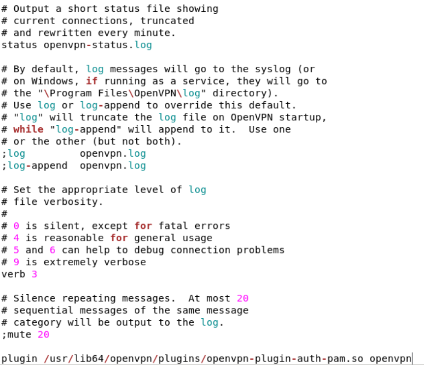

<center>

# **PL3 Setup (currently under maintenance)**

## **Warnings**

- ### All of these configurations are made on CentOS 7, make sure to use the same image, which you can get it [here](http://ftp.dei.uc.pt/pub/linux/CentOS/7.9.2009/isos/x86_64/) and select the "**CentOS-7-x86_64-Everything-2207-02.iso**" image. Also, it was used VirtualBox which you can get [here](https://www.virtualbox.org/wiki/Downloads) (you can use others like VmWare, but there might be some visual changes).

- ### **Don't forget** to fill/complete your server.conf and roadwarrior-client.conf files! 
---
# **Table of contents** 
- [1. Connect the WiFi adapters](#1-connect-the-wifi-adapters)
- [2. Client](#2-client)
- [3. Clone the VM](#3-clone-the-vm)
- [4. Setup the connections](#4-setup-the-connections)
- [5. Turn off your firewall before proceding](#5-turn-off-your-firewall-before-proceding)
- [6. Prepare your server.conf and roadwarrior-client.conf](#6-prepare-your-serverconf-and-roadwarrior-clientconf)
- [7. Install Wireshark on the Client VM (optional)](#7-install-wireshark-on-the-client-vm-optional)
- [8. Two-Factor Authenticator](#8-two-factor-authenticator)
- [9. Apache](#9-apache)
- [10. OCSP](#10-ocsp)

---
  
## **1. Connect the wifi adapters:**
</center>

- Go to the settings page of your VM</br><center>
</br></br>

- Go to the network section and copy the following setup:</br><center>
</br>
</br></br>

- Afterwards, turn on your VM and connect both adapters:</br><center>
</br></br>
---

- ## ***Both previous configurations and the Client configurations are needed on the the VPN and Server VMs. Do the following steps on the VM which will run as the client and then clone the VM***

---
<center> 

## **2. Client**

</center> 

- **2.1. Install openvpn:**
``` bash
yum install openvpn
```
- **2.2. Go to this folder:**
```bash
cd /usr/share/doc/openvpn-2.4.12/
```
- **2.3. Go to this folder:**
```bash
cd sample/sample-config-files/
```
- **2.4. And copy the server.conf file to another location (don't change the original)**
```bash
cp server.conf {folder}
```
- **2.5. Change the permissions of the file in case you can't edit it (you may not need this step)**
```bash
sudo chmod o+rwx {path/roadwarrior-client.conf}
```

- **2.6. Copy the roadwarrior-client.conf to the same location where you saved the server.conf file**
```bash
cp roadwarrior-client.conf {path}
```
- **2.7. Change the permissions of the file in case you can't edit it (you may not need this step)**
```bash
sudo chmod o+rwx {path/roadwarrior-client.conf}
```
- **2.8. Check if everything is in order with ifconfig** (The first two entries show what you are looking for - enp0s3 and enp0s8)**:**
```bash
ifconfig
```

- **2.9. Install Apache server** (thecnically only needed on the VPN VM, but it's fine to have it on all of them)**:**
```bash
yum install httpd
```
- **Note:** to run the apache server, afterwards, run the following command:
```bash
systemctl start httpd
```
---
<center>

## **3. Clone the VM**

</center>

- **3.1. Press right click on top of your VM and select clone (Ctrl + O).**
- **3.2. Change the name accordingly to if it is the VPN or the Server VM. (not mandatory but it helps to keep track of the VMs)**
- **3.3. change the MAC Address Policy to "Generate new MAC address for all network cards" and press next.**</br></br>

- 4. Press "Full clone" and press finish.

--- 

## **4. Setup the connections**
- **Follow the next steps to configure your network:**
4.1. Click on wired settings;


4.2. Click on the enp0s8 settings; 


4.3. Setup the addresses and networks for all your VMs. 


- ***Tip - use the following image to help you setup your network:***


---

## **5. Turn off your firewall before proceding:**

```bash
systemctl stop firewalld
```
---

## **6. Prepare your server.conf and roadwarrior-client.conf**
## COMPLETE BOTH (server.conf and roadwarrior-client.conf) FILES BEFORE PROCEDING!
- ### **6.1. On the Client VM run:** 

```bash
openvpn {path/roadwarrior-client.conf}
```

- ### **6.2 On the Server VM run:**

```bash
openvpn {path/server.conf}
```

and type your password when prompted.

---

## **7. Install Wireshark on the Client VM (optional):**

```bash
yum install wireshark-gnome
```

- ### **7.1. Run Wireshark (as root in order to have full capabilities):**

```bash
sudo wireshark
```

- ### **7.2. Select the following interfaces (enp0s8 and tun0) and press start:**


- ### **7.3 Click on a package, with the right button of the mouse, with an OpenVPN protocol and select "Decode as":**


- ### **7.4 Select "Do not decode" and press ok:**


- ### **7.5 Should look something like this (you can look at what the teacher provided):**


---
## **8. Two-Factor Authenticator**
- This is **ALL** made on the VPN Server machine **ONLY**
- ### **8.1. Install google authenticator**
```bash
yum install google-autenticator*
```

- ### **8.2. Add clients:**
```bash
useradd gauth
mkdir /etc/openvpn/google-authenticator
cd /etc/openvpn && chown gauth:gauth google-authenticator && chmod 700 google-authenticator
semanage fcontext -a -t openvpn_etc_rw_t -ff '/etc/openvpn/google-authenticator(/.*)?'
```
- ### **8.3. Create file create_gauth.sh**
```bash
nano /root/create_gauth.sh
```
  + #### **8.3.1. Paste the following text:**
  ```bash
#!/bin/sh

# Parse arguments
USERNAME="$1"

if [ -z "$USERNAME" ]; then
  echo "Usage: $(basename $0) <username>"
  exit 2
fi

# Set the label the user will see when importing the token:
LABEL='OpenVPN Server'

su -c "google-authenticator -t -d -r3 -R30 -W -f -l \"${LABEL}\" -s /etc/openvpn/google-authenticator/${USERNAME}" - gauth
  ```
  
- ### **8.4. Edit create_gauth.sh permissions**
```bash
chmod 700 /root/create_gauth.sh
```
- ### **8.5. Add user**
```bash
 useradd -s /sbin/nologin cliente
 passwd cliente
 /root/create_gauth.sh cliente
```
- ### **8.6. Add the following line on the VPN server.conf file:**
```conf
plugin /usr/lib64/openvpn/plugins/openvpn-plugin-auth-pam.so openvpn
```


- ### **8.7. Create and setup openvpn file on pam.d**
- #### **8.7.1. Create file**
```bash
 nano /etc/pam.d/openvpn
```
- #### **8.7.2. Paste the following text there:**
```
auth [user_unknown=ignore success=ok ignore=ignore default=bad] pam_securetty.so
auth required /lib64/security/pam_google_authenticator.so secret=/etc/openvpn/google-authenticator/${USER} user=gauth forward_pass
auth include system-auth
account include system-auth
password include system-auth
```

- ### **8.8. Install Google Authenticator on your smartphone and scan the generated QR code when you ran "/root/create_gauth.sh cliente". This should give you a key with 6 digits which will update from time to time.**

- ### **8.9. Run the following commands:**
- #### **8.9.1 On the VPN Server:**
```bash
openvpn {path}/server.conf
```
- #### **8.9.2 On the Client:**
```bash
openvpn {path}/roadwarrior-client.conf
```
- ### **8.10. CAREFUL! When asked for your password on the authentication place your password followed by the code generated! [Source](https://github.com/evgeny-gridasov/openvpn-otp#:~:text=When%20users%20vpn%20in%2C%20they%20will%20need%20to%20provide%20their%20username%20and%20pin%2Bcurrent%20OTP%20number%20from%20the%20OTP%20token.%20Examples%20for%20users%20bob%2C%20alice%20and%20john%3A)**

--- 
## **9. Apache**
- TODO
---

## **10. OCSP**
- ### **10.1. Search for the file ssl.conf (on the vpn server) on:**
```bash
more /etc/httpd/conf.d/ssl.conf
```
and check if the output is: 
``` (...) 
SSLOCSPEnable on 
```

- If not, run [``` sudo yum install mod_ssl ```](https://unix.stackexchange.com/questions/263401/what-do-i-do-if-i-cant-find-ssl-conf-file-in-a-centos-server#:~:text=sudo%20yum%20install%20mod_ssl)


[ssl.conf](https://httpd.apache.org/docs/2.4/mod/mod_ssl.html#sslocspdefaultresponder:~:text=and%20SSLOCSPOverrideResponder%20directives.-,Example,on%0ASSLOCSPDefaultResponder%20%22http%3A//responder.example.com%3A8888/responder%22%0ASSLOCSPOverrideResponder%20on,-SSLOCSPNoverify%20Directive)

