<center>

# **PL3 Setup (currently under maintenance)**

## **Warnings**

- ### All of these configurations are made on CentOS 7, make sure to use the same image, which you can get it [here](http://ftp.dei.uc.pt/pub/linux/CentOS/7.9.2009/isos/x86_64/) and select the "**CentOS-7-x86_64-Everything-2207-02.iso**" image. Also, it was used VirtualBox which you can get [here](https://www.virtualbox.org/wiki/Downloads) (you can use others like VmWare, but there might be some visual changes).

- ### **Don't forget** to fill/complete your server.conf and roadwarrior-client.conf files! 
  
---
  
## **1. Connect the wifi adapters:**
</center>

- Go to the settings page of your VM</br><center>
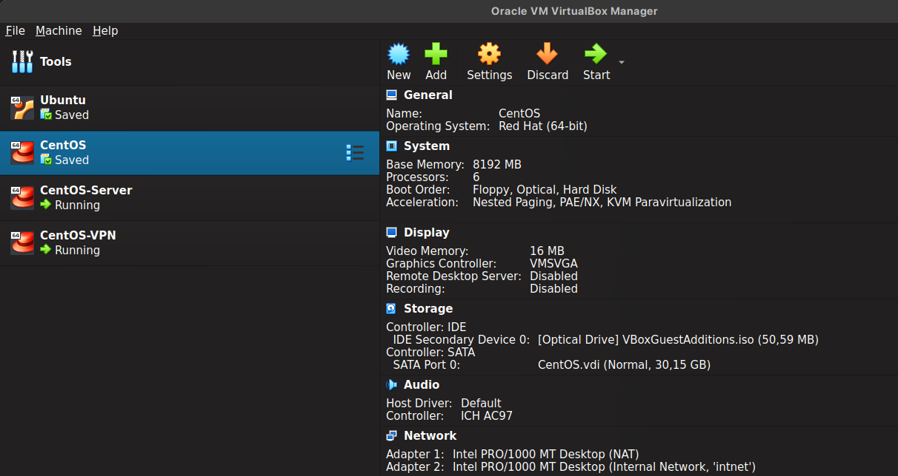</br></br>

- Go to the network section and copy the following setup:</br><center>
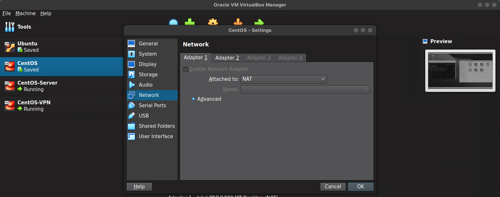</br>
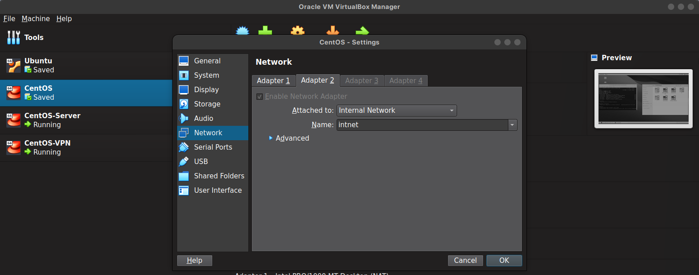</br></br>

- Afterwards, turn on your VM and connect both adapters:</br><center>
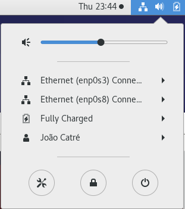</br></br>
---

- ## ***Both previous configurations and the Client configurations are needed on the the VPN and Server VMs. Do the following steps on the VM which will run as the client and then clone the VM***

---
<center> 

## **2. Client**

</center> 

- **2.1. Install openvpn:**
``` bash
yum install openvpn
```
- **2.2. Go to this folder:**
```bash
cd /usr/share/doc/openvpn-2.4.12/
```
- **2.3. Go to this folder:**
``` bash
cd sample/sample-config-files/
```
- **2.4. And copy the server.conf file to another location (don't change the original)**
``` bash
cp server.conf {folder}
```
- **2.5. Change the permissions of the file in case you can't edit it (you may not need this step)**
``` bash
sudo chmod o+rwx {path/roadwarrior-client.conf}
```

- **2.6. Copy the roadwarrior-client.conf to the same location where you saved the server.conf file**
``` bash
cp roadwarrior-client.conf {path}
```
- **2.7. Change the permissions of the file in case you can't edit it (you may not need this step)**
``` bash
sudo chmod o+rwx {path/roadwarrior-client.conf}
```
- **2.8. Check if everything is in order with ifconfig** (The first two entries show what you are looking for - enp0s3 and enp0s8)**:**
``` bash
ifconfig
```

- **2.9. Install Apache server** (thecnically only needed on the VPN VM, but it's fine to have it on all of them)**:**
``` bash
yum install httpd
```
- **Note:** to run the apache server, afterwards, run the following command:
``` bash
systemctl start httpd
```
---
<center>

## **3. Clone the VM**

</center>

- **3.1. Press right click on top of your VM and select clone (Ctrl + O).**
- **3.2. Change the name accordingly to if it is the VPN or the Server VM. (not mandatory but it helps to keep track of the VMs)**
- **3.3. change the MAC Address Policy to "Generate new MAC address for all network cards" and press next.**</br></br>
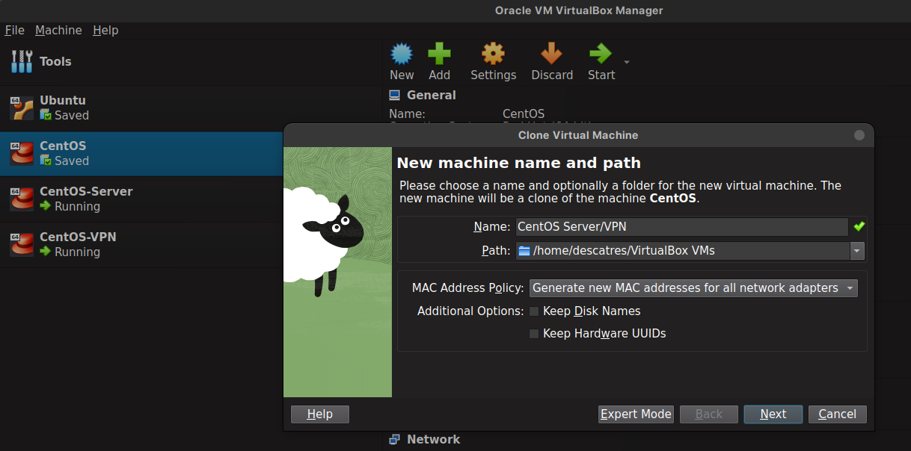
- 4. Press "Full clone" and press finish.

--- 

## **4. Setup the connections**
- **Follow the next steps to configure your network:**
4.1. Click on wired settings;

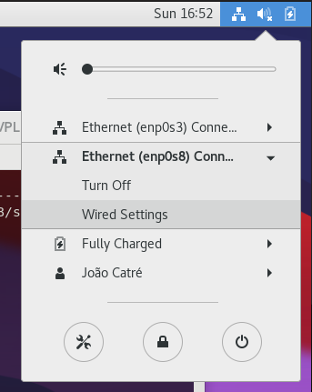

4.2. Click on the enp0s8 settings; 

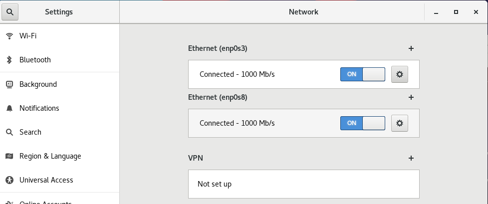

4.3. Setup the addresses and networks for all your VMs. 

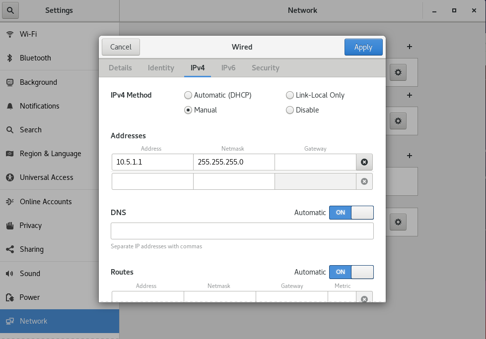

- ***Tip - use the following image to help you setup your network:***

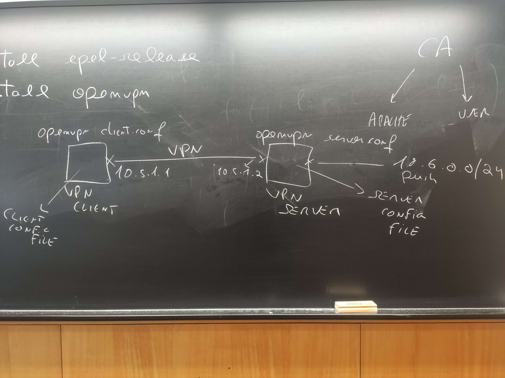

---

## **5. Turn off your firewall before proceding:**

``` bash
systemctl stop firewalld
```
---

## **6. Prepare your server.conf and roadwarrior-client.conf**

- ### **6.1. On the Client VM run:** 

``` bash
openvpn {path/roadwarrior-client.conf}
```

- ### **6.2 On the Server VM run:**

``` bash
openvpn {path/server.conf}
```

and type your password when prompted.

---

## **7. Install Wireshark on the Client VM (optional):**

```bash
yum install wireshark-gnome
```

- ### **7.1. Run Wireshark (as root in order to have full capabilities):**

``` bash
sudo wireshark
```

- ### **7.2. Select the following interfaces (enp0s8 and tun0) and press start:**

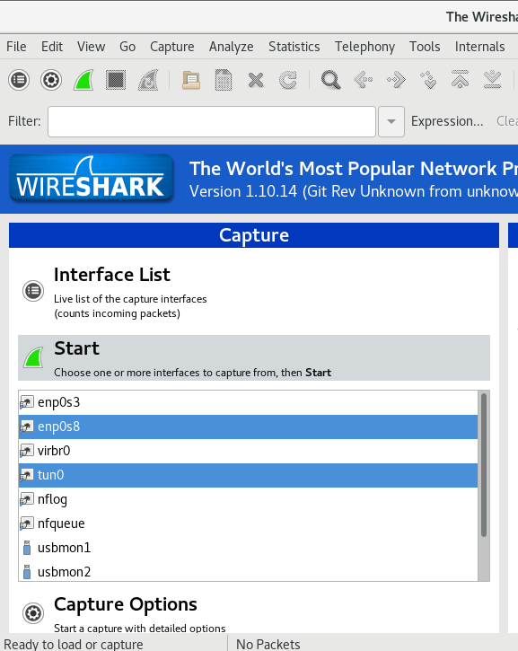

- ### **7.3 Click on a package, with the right button of the mouse, with an OpenVPN protocol and select "Decode as":**

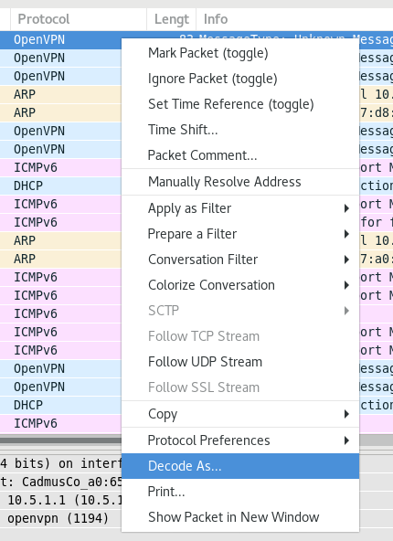

- ### **7.4 Select "Do not decode" and press ok:**

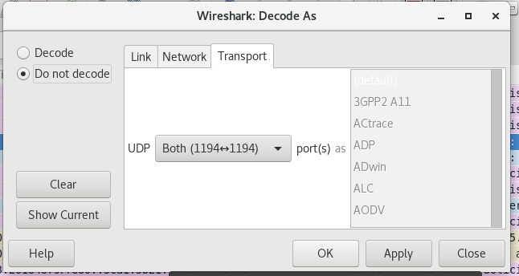

- ### **7.5 Should look something like this (you can look at what the teacher provided):**

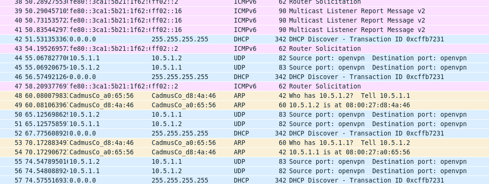

---
